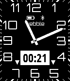

# modeern-timer

An analog watchface app based on Lukasz Zalewski's design with the addition of a stopwatch and countdown timer.

The timer function is started by pressing the select button and then either the up or down buttons depending on what type of timer is required.

Various features of the app, including the color of the watchface, are configurable in st=ettings which also included full instructions on how to operate the timer function.
